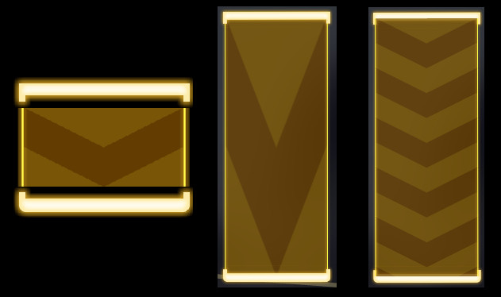

# 资源包

资源包包含了音符、打击粒子、打击音效、判定线颜色

## 结构

资源包是一个 zip 压缩文件，其中包含了配置文件 `info.yml` 和其他的资源文件。其中，资源文件有些是必须存在，有些则是可选的，目前大部分配置与 Phira 兼容

### 资源文件

必须

- `click.png` 和 `click_mh.png`：Click 音符的皮肤，`mh` 代表双押
- `drag.png` 和 `drag_mh.png`：Drag 音符的皮肤
- `flick.png` 和 `flick_mh.png`：Flick 音符的皮肤
- `hold.png` 和 `hold_mh.png`：Hold 音符的皮肤
- `hit_fx.png`：打击特效图片

可选 (不存在将使用默认)

- `click.ogg` `drag.ogg` `flick.ogg` 对应音符的打击音效，注意采样率在 `Phi Recorder` 中必须为 48000Hz
- `ending.ogg` 结算界面背景音乐。

### 配置文件

配置文件采用 yml，示例如下 (以默认为例)

```yml
# 必填
name: "Phigros Official"
author: "PigeonGames"
hitFx: [5, 6]
holdAtlas: [50, 50]
holdAtlasMH: [98, 98]
# 选填
description: ""
hitFxDuration: 0.5
hitFxScale: 1.0
hitFxRotate: false
hideParticles: false
holdKeepHead: false
holdRepeat: false
holdCompact: false
hitFxTinted: true
LineTinted: true
colorPerfectFx: (1.0, 0.9, 0.65, 0.9)
colorGoodFx: (0.70, 0.9, 1.0, 1.0)
colorPerfectLine: (1.0, 1.0, 0.7, 1.0)
colorGoodLine: (0.65, 0.94, 1.0, 1.0)
```

- `name` 资源包的名字
- `author` 资源包的作者
- `hitFx` 打击特效宽、高的个数，用于切割原图生成动画
- `holdAtlas` Hold 贴图的尾、头像素。Hold 的皮肤是 **一张图片**，从上到下分别为 Hold 的尾部、中间和头部。而 `holdAtlas` 的两个数字则分别指定了图片中尾部和头部的高度。例如，在 [此图](image/hold.png) 中，尾部和头部高度均为 50 像素
- `holdAtlasMH` 意义与上一条相同，指定多押 Hold 的尾、头像素

此外还有选填项

- `description` 资源包介绍
- `hitFxDuration` (小数，默认 `0.5`)  打击特效的持续时间，以秒为单位
- `hitFxScale` (小数，默认 `1.0`)  打击特效缩放比例
- `hitFxRotate` (布尔值，默认 `false`)  打击特效是否随 Note 旋转
- `hideParticles` (布尔值，默认 `false`)  是否隐藏粒子效果
- `holdKeepHead` (布尔值，默认 `false`)  Hold 触线后是否显示头部
- `holdRepeat` (布尔值，默认 `false`)  Hold 的中间部分是否采用重复式拉伸。 这里的三张图从左到右依次是 Hold 原图、不启用 `holdRepeat` 时的长条和启用 `holdRepeat` 时的长条
- `holdCompact` (布尔值，默认 `false`)  是否把 Hold 的头部和尾部与 Hold 中间重叠 (将锚点居中)。还是用上面的图，如果不开启 `holdCompact`，效果就会是左边第一张图，Hold 的头尾是和中间隔开的；而右边两张图都是开启了 `holdCompact` 的效果
- `hitFxTinted` (布尔值，默认 `true`)  打击特效是否着色
- `LineTinted` (布尔值，默认 `true`)  判定线是否着色
- `colorPerfectFx` AP (All Perfect) 情况下的打击特效颜色 `(R, G, B, A)` 内容均为 `0.0..1.0` 的 `浮点数`
- `colorGoodFx` FC (Full Combo)  情况下的打击特效颜色
- `colorPerfectLine` AP (All Perfect)  情况下的判定线颜色
- `colorGoodLine` FC (Full Combo)  情况下的判定线颜色
