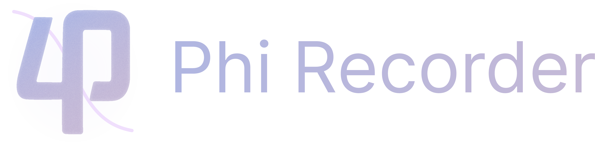

# 关于 Phi Recorder

## 项目

`Phi Recorder` 与 `Phire 游玩器 (Phire-UI)` 使用的内核均为 `Phire`，本质上都属于为 `Phire` 制作的前端  
`Phire` 是一个开源的游玩器内核，前身为 `prpr`，可播放和游玩大多数格式的谱面

## 关于版本

该文档以最新 Windows 端开发版本为标准，可能与最新正式版有所不同  
若遇到问题，请在提交 Issue 前先下载最新开发版本进行测试，找出稳定的复现方式，详细描述遇到的问题，发送有关的日志

## 注意事项 / Notice

- 请不要伪造游玩成绩、官方内容等，以免造成不好的影响  
- 游玩界面与本家有明显区分, 如 COMBO 处文本与 `COMBO` 有明显区分
- 不建议向不使用 `Re: PhiEdit` 的玩家分享本软件
