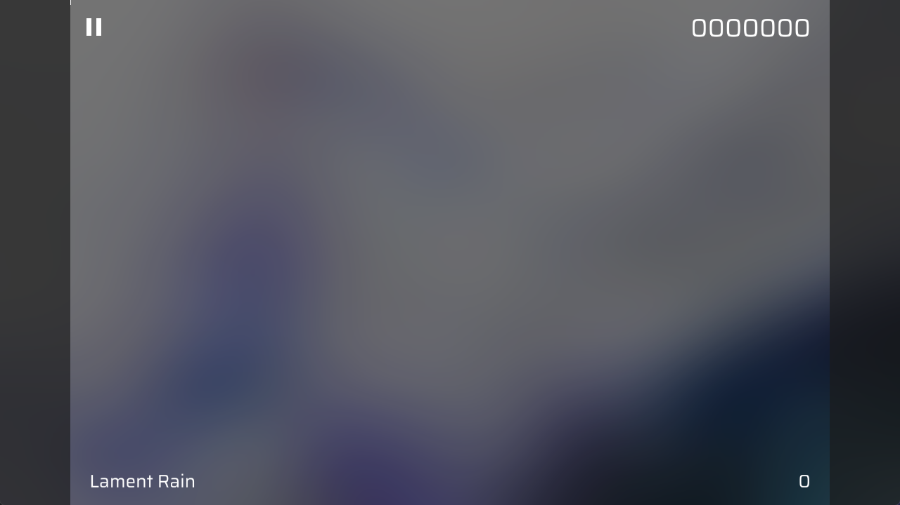

# 渲染设置

## 预设  

- 可以保存设置，方便下次使用，不能与默认预设重名

## 常用

- ~~右键设置项即可将其添加到常用设置中，再次右键几个移除~~ (本功能还在咕咕咕，暂时只有默认的几个)

## 输出

- 分辨率✏️  
  该项会根据谱面信息中的宽高比自动更新 `h*宽高比 x h`，当分辨率宽高比大于谱面宽高比时会显示边框 (如图)
  

- 采样数  
  大于 1 的采样数（必须为 2 的幂）会启用 MSAA 抗锯齿，在低性能的显卡上可能会降低渲染速度

- 硬件加速  
  使用显卡的硬件编码器对视频编码，会显著降低视频编码时间  
  注意: Phi Recorder 的画面渲染始终使用 GPU 处理，该项只影响视频编码方式

- 编码器✏️  
  视频编码的编码器，默认为 AVC，选择 HEVC 可获得更高的编码质量和更小的文件体积，但编码时间可能会显著增加  
  ~~选择 MPEG4 即可获得 RPE Recorder 同款画质~~

- 编码器预设✏️  
  质量不会好多少，但速度会下降较多，一般不用动

- 动态码率  
  动态码率会根据画面复杂度自动调整码率，可以在文件体积较小的同时保持较高的画质

- 质量参数  
  范围 1-51 值越大文件体积越小，但画质会下降  
  - 23: 几乎无损  
  - 28: 比较平衡的值  
  - 40: 较低的文件体积，适合在聊天软件中预览

- 码率  
  在动态码率关闭时生效，效果不如动态码率，不推荐使用

## 图像

- 资源包  
  支持加载 Phira 资源包，但需要注意音频的采样率需要为 48000Hz

- 谱面调试  
  - 判定线:  

  ```string
  [线号]父线号 h:判定线流过的距离 z轴坐标 绑定UI 锚点 判定线类型
  ```

  - 音符:  

  ```string
  [所在线号] t:判定时间(判定结束时间) h:在判定线上的高度(结束时的高度)[在屏幕上的高度]
  速度 是否从判定线下方落下 是否为假音符
  ```

- 激进优化  
  剔除所有屏幕外的音符，在音符数量多时可以大幅提升画面渲染速度，但可能会导致部分音符消失

- 水印  
  画面最下方的小字

- 粒子限制 (整数)✏️  
  同屏粒子超过上限时将不会继续生成粒子，与显卡性能有关  
  低: 20000 中: 100000 高: 800000

## 音频

Phi Recorder 使用 Float32 格式的音频，0.0 为 -∞ dB ，1.0 为 0 dB  
推荐总音量不超过 1.0，否则可能会影响音乐音质 (除非你玩响度战争)，点击右侧的按钮即可搭配响度均衡一键调整到合适的值

- 音效强制限幅  
  打击音的总音量会被限制为最大音效音量的值，不建议关闭

- 音效压缩比
  调整为 1 即可禁用压缩，打击音音量超过 0 dB 后进行压缩的比例，该项效果一般，推荐使用音效强制限幅

- 无损音频  
  开启后会输出 float32 格式的 PCM 音频，可存储大于 0 dB 的数据  
  虽然可以存储大于 0 dB 的数据但这会触发系统的音频限幅，导致音质严重下降，不建议这么做

- 音乐响度均衡
  调整音乐响度到 -16LUFS，符合 EBU R128 广播级响度标准，可以避免音乐过小或过大

## 其他

- 自定义难度  
  本项仅用于搭配罗马模式和中文模式使用，将难度显示在加载页

- 上隐/下隐  
  单位大小半个屏幕，正数上隐，负数下隐

- 透明度染色
  根据不同的透明度对Note染色  
  (0.0,0.5]蓝色  
  (0.5,1.0)红色
